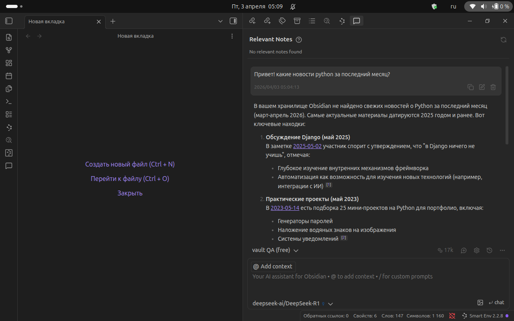
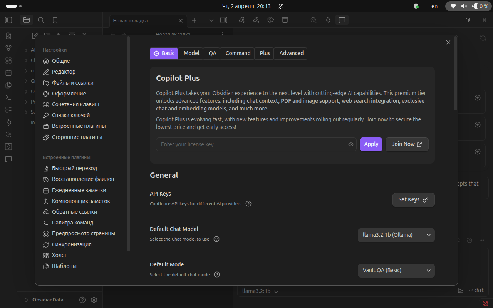
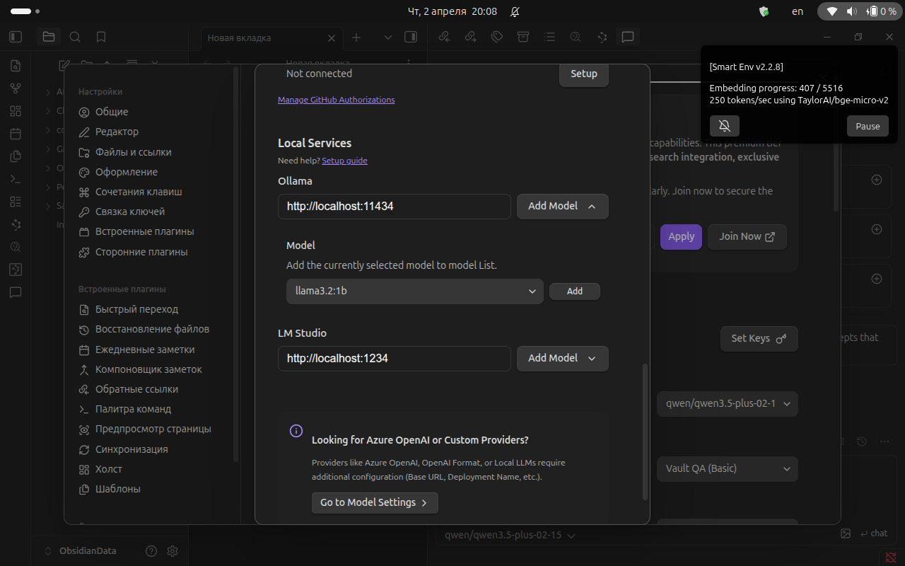
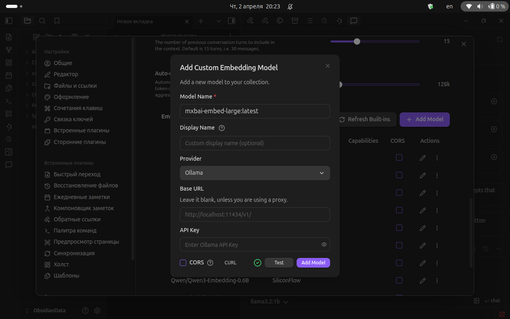
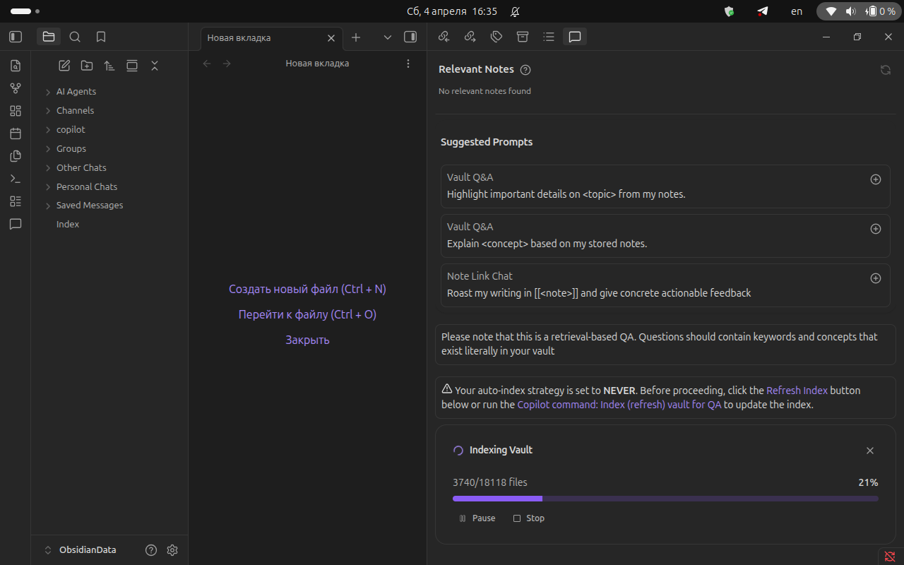
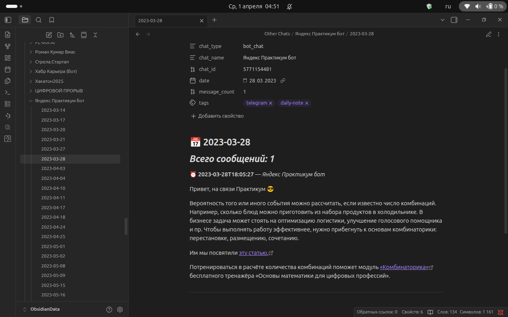
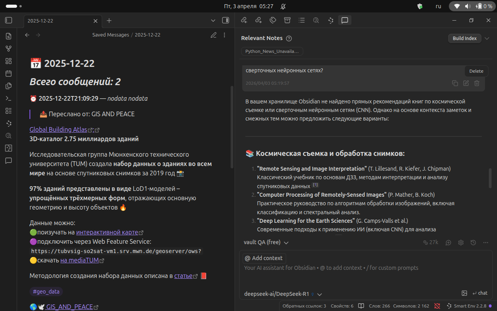
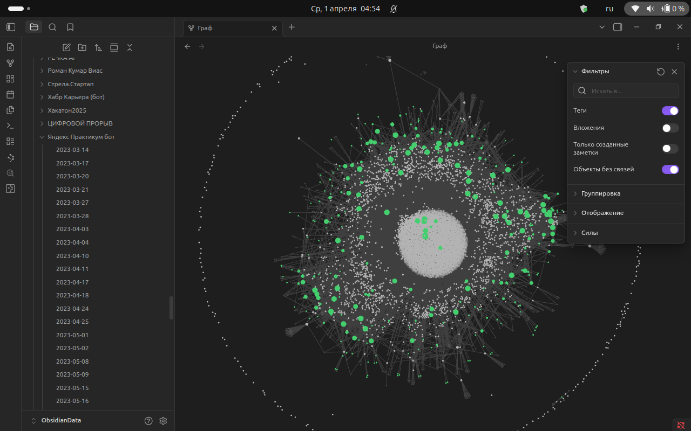

# 📱 AI-agents: Telegram to Obsidian Converter with Smart Search and Note Analysis
*ИИ-анент: Конвертер Telegram в Obsidian с интеллектуальным поиском и анализом заметок*

Конвертирует экспорт данных Telegram в заметки Obsidian с полной поддержкой медиафайлов, форматирования, группировки по дням и AI-интеграции для умного поиска и аналитики.


---

## ✨ Превью

На данный момент - это не полноценный ИИ-агент, а только часть исследований направленных на его создание. А точнее освоение и улучшение технологии создания подобных систем.

**Сейчас это:**

*Retrieval-Augmented Generation (RAG)* — это архитектурный подход в ИИ, объединяющий большие языковые модели (LLM) с внешними базами знаний для генерации точных, актуальных ответов. Он решает проблемы галлюцинаций (ложных фактов) и ограниченных знаний LLM, извлекая релевантные данные (поиск) перед генерацией текста. 

**Основные характеристики RAG-систем:**
- Доступ к свежим данным: Подключается к внутренним базам, документам или интернету в реальном времени, не требуя переобучения модели.
- Снижение галлюцинаций: Модель основывает ответ на проверенных фактах из внешних источников, а не только на «памяти» обучения.

**Принцип работы (Пайплайн):**
- Поиск (Retrieval): Векторизация запроса и поиск похожих документов в базе данных.
- Обогащение (Augmentation): Добавление найденного контекста к запросу пользователя.
- Генерация (Generation): LLM создает итоговый ответ, опираясь на предоставленный контекст.  

**Можете думать про это [так](PREVIEW.md):**

Это не "агент" в строгом академическом смысле, но это практический, работающий инструмент с агентоподобными возможностями. Для большинства пользователей разница не важна — главное, что система решает задачу: делает данные из Telegram доступными, связными и "понятными" для ИИ.
Если хотите назвать это агентом для маркетинга или презентации — это допустимо, но с уточнением: "Агентоподобная система для управления персональными знаниями на базе Telegram-экспорта".

---

## ✨ Возможности

- 📝 **Преобразование сообщений** — все сообщения конвертируются в заметки Markdown
- 🖼️ **Медиафайлы** — фото, видео, стикеры, документы копируются в папку с заметкой
- 🔗 **Ссылки и форматирование** — сохраняются все ссылки, жирный текст, курсив, код
- 🎭 **Спойлеры** — преобразуются в callout блоки или скрытый текст
- 👥 **Контакты** — создаются отдельные заметки для всех контактов
- 📑 **Индексный файл** — главная страница со статистикой экспорта
- 🚀 **Группировка по дням** — сообщения группируются по датам для лучшей организации
- 📂 **Поддержка JSON** — работает с JSON-экспортом Telegram Desktop
- 🧠 **AI-интеграция** — подключение Obsidian Copilot для умного поиска и аналитики по заметкам

---



## 📥 Шаг 1: Экспорт данных из Telegram

### 📋 Подготовка экспорта

Для работы конвертера необходимо сначала экспортировать данные из Telegram. **Важно:** экспорт доступен **только в десктопной версии** Telegram!

#### Вариант 1: Полный экспорт всех чатов

1. **Откройте Telegram Desktop** на вашем компьютере

2. **Перейдите в настройки экспорта:**
   
   ```
   Настройки → Продвинутые настройки → Экспорт данных из Telegram
   ```
   
   *(Прокрутите настройки до самого конца)*

3. **Выберите данные для экспорта:**
   
   Рекомендуемые настройки:
   - ✅ **Личные данные** (личные переписки)
   - ✅ **Частные группы**
   - ✅ **Частные каналы**
   - ✅ **Фотографии**
   - ✅ **Видео**
   - ✅ **Голосовые сообщения** (если нужны)
   - ✅ **Стикеры** (если нужны)

4. **Выберите формат и путь сохранения:**
   
   - **Формат:** JSON (обязательно), HTML (опционально)
   - **Размер медиа:** выберите подходящий (для полного экспорта — максимальный)
   - **Путь сохранения:** укажите папку на компьютере

5. **Нажмите «Экспортировать»** и дождитесь завершения процесса

#### Вариант 2: Экспорт конкретного чата

Если нужно экспортировать только определенный чат или канал:

1. **Откройте нужный чат/канал** в Telegram Desktop

2. **Нажмите на меню** (три точки в правом верхнем углу)

3. **Выберите «Экспорт истории чата»**

4. **Отметьте нужные данные:**
   - Фотографии
   - Видео
   - Голосовые сообщения
   - Видео сообщения
   - Стикеры
   - И т.д.

5. **Выберите формат JSON** и нажмите «Экспортировать»

### ⚠️ Важное примечание о каналах

Telegram экспортирует **только ваши сообщения** в каналах. Если вы подписчик канала (не администратор), экспорт будет пустым (`No outgoing messages`). Это ограничение Telegram, а не конвертера.

### 📁 Структура экспорта

После экспорта вы получите папку со следующей структурой:

```
DataExport_YYYY-MM-DD/
├── result.json              # Файл с метаданными (обязателен!)
├── chats/
│   ├── chat_001/
│   │   ├── messages.html
│   │   ├── messages2.html
│   │   └── photos/
│   └── chat_002/
│       └── ...
├── profile_pictures/
└── export_results.html
```

**Важно:** Убедитесь, что в экспорте присутствует файл `result.json` — он необходим для работы конвертера!

---

## 📥 Шаг 2: Установка Obsidian

### Скачивание и установка

1. **Перейдите на официальный сайт:**
   
   🔗 [**Скачать Obsidian**](https://obsidian.md/download)

2. **Выберите вашу операционную систему:**
   - Windows (.exe установщик)
   - macOS (.dmg образ)
   - Linux (AppImage, Snap, Flatpak)

3. **Установите приложение** следуя инструкциям установщика

4. **Запустите Obsidian** и создайте новое хранилище (vault):
   - Нажмите «Create new vault»
   - Укажите имя и расположение папки
   - Нажмите «Create»

---

## 🔧 Шаг 3: Установка конвертера

### 1. Клонирование репозитория

```bash
git clone git@github.com:Inna949Festchuk/telegram_obsidian_sync.git
cd telegram_obsidian_sync
```

### 2. Создание виртуального окружения (рекомендуется)

**Linux/Mac:**
```bash
python -m venv venv
source venv/bin/activate
```

**Windows:**
```bash
python -m venv venv
venv\Scripts\activate
```

### 3. Установка зависимостей

```bash
pip install -r requirements.txt
```

Или вручную:
```bash
pip install python-dotenv==1.0.0
```

---

## ⚙️ Настройка конвертера

### Создание файла `.env`

Создайте файл `.env` в папке со скриптом:

```env
# Путь к JSON файлу экспорта Telegram
TELEGRAM_JSON_FILE=/home/konstantin/Загрузки/Telegram Desktop/DataExport_2026-03-26/result.json

# Корневая папка, где лежат медиафайлы
TELEGRAM_EXPORT_BASE=/home/konstantin/Загрузки/Telegram Desktop/DataExport_2026-03-26

# Папка для сохранения заметок Obsidian
OBSIDIAN_OUTPUT_DIR=/home/konstantin/Документы/ObsidianData/ObsidianData

# Копировать ли медиафайлы
COPY_MEDIA=true

# Копировать ли аватарки
COPY_PROFILE_PICS=true

# Создавать ли индексный файл
CREATE_INDEX=true

# Создавать ли заметки контактов
CREATE_CONTACTS=true

# Добавлять ли frontmatter (метаданные YAML)
CREATE_FRONTMATTER=true

# Преобразовывать ли спойлеры в callout блоки
SPOILER_AS_CALLOUT=true

# Группировать сообщения по дням (рекомендуется для больших экспортов)
GROUP_BY_DAY=true

# Минимальное количество сообщений для создания файла дня
MIN_MESSAGES_PER_DAY=1
```

### Описание настроек

| Параметр | Описание | Значения |
|----------|----------|----------|
| `TELEGRAM_JSON_FILE` | Путь к файлу result.json | путь к файлу |
| `TELEGRAM_EXPORT_BASE` | Корневая папка экспорта Telegram | путь к папке |
| `OBSIDIAN_OUTPUT_DIR` | Папка для сохранения заметок | путь к папке |
| `COPY_MEDIA` | Копировать ли медиафайлы | true/false |
| `COPY_PROFILE_PICS` | Копировать ли аватарки | true/false |
| `CREATE_INDEX` | Создавать ли индексный файл | true/false |
| `CREATE_CONTACTS` | Создавать ли заметки контактов | true/false |
| `CREATE_FRONTMATTER` | Добавлять ли метаданные YAML | true/false |
| `SPOILER_AS_CALLOUT` | Спойлеры как callout блоки | true/false |
| `GROUP_BY_DAY` | Группировать сообщения по дням | true/false |
| `MIN_MESSAGES_PER_DAY` | Мин. сообщений для файла дня | число |

---

## 🧠 Шаг 4: Настройка AI для умного поиска

### 4.1 Установка плагина Obsidian Copilot

Для AI-поиска по заметкам используется плагин **Obsidian Copilot**.

#### Установка плагина

```
1. Obsidian → Настройки → Community plugins
2. Отключите "Restricted mode" если включён
3. Browse → Поиск "Copilot"
4. Install → Enable
```



### 4.2 Настройка эмбеддингов (SiliconFlow + Qwen)

```
Настройки → Copilot → Embedding Settings:
┌─────────────────────────────────────────────────────────┐
│  Embedding Provider: SiliconFlow                        │
│  API Key: sk-xxxxxxxxxxxxxxxx                           │
│  Model: Qwen/Qwen3-Embedding-0.6B                       │
└─────────────────────────────────────────────────────────┘
```


**Получение API ключа:**
1. Перейдите на [https://cloud.siliconflow.cn](https://cloud.siliconflow.cn)
2. Зарегистрируйтесь
3. Получите API ключ в разделе API Keys

### 4.3 ⚠️ Критически важные настройки для больших хранилищ

Для хранилищ с 10 000+ файлов **обязательно** настройте:

```
┌─────────────────────────────────────────────────────────┐
│  Advanced Settings (КРИТИЧНО!)                         │
├─────────────────────────────────────────────────────────┤
│  Requests per Minute: 10        ← Уменьшить с 60       │
│  Embedding Batch Size: 2        ← Уменьшить с 16 ❗    │
│  Number of Partitions: 1-2      ← Для больших vaults   │
│  Lexical Search RAM Limit: 50   ← Уменьшить с 100 MB   │
└─────────────────────────────────────────────────────────┘
```

**Почему это важно:**
- `Batch Size: 2` предотвращает краши при индексации
- `Requests per Minute: 10` избегает лимитов API SiliconFlow
- `RAM Limit: 50 MB` снижает нагрузку на систему

### 4.4 Настройка чата (опционально)

```
Chat Settings:
• Provider: SiliconFlow (или Ollama для локальной работы)
• Model: Qwen/Qwen3.5-72B-Instruct (онлайн) или llama3.2:1b (локально)
• API Key: ваш ключ SiliconFlow
```


### 4.5 Запуск индексации

```
1. Убедитесь, что API ключ настроен
2. Настройки → Copilot → Advanced
3. Нажмите "Purge and Reindex" или "Re-index vault"
4. Дождитесь завершения (может занять несколько часов для 18 000 файлов)
```


**Мониторинг прогресса:**
- Откройте Developer Console: `Ctrl+Shift+I`
- Следите за логами плагина `plugin:copilot`
- Прогресс сохраняется автоматически

### 4.6 Альтернативные варианты подключения LLM

Если вы хотите использовать другие модели (онлайн или локальные), ознакомьтесь с дополнительными документами:

| Документ | Описание | Ссылка |
|----------|----------|--------|
| 🧠 Локально vs Онлайн | Сравнение всех вариантов подключения, требования к железу, стоимость | [`🧠 Настройка AI для Obsidian: Локально vs Онлайн.md`](./🧠%20Настройка%20AI%20для%20Obsidian:%20Локально%20vs%20Онлайн.md) |
| 🇨🇳 Qwen 3.5 + DeepSeek | Настройка китайских моделей через API (дешевле GPT-4) | [`🇨🇳 Настройка AI для Obsidian: Qwen 3.5 и DeepSeek (Онлайн).md`](./🇨🇳%20Настройка%20AI%20для%20Obsidian:%20Qwen%203.5%20и%20DeepSeek%20(Онлайн).md) |
| 🇷🇺 Sber GigaChat | Настройка российской нейросети GigaChat (серверы в РФ, 152-ФЗ) | [`🇷🇺 Настройка AI для Obsidian: nomic-embed + Sber GigaChat.md`](./🇷🇺%20Настройка%20AI%20для%20Obsidian:%20nomic-embed%20+%20Sber%20GigaChat.md) |

### 4.7 Сравнение вариантов

| Вариант | Эмбеддинги | Чат | Цена/месяц | RAM | Приватность |
|---------|------------|-----|------------|-----|-------------|
| Ollama (локально) | nomic-embed-text | llama3.2:1b | $0 | 4-6 GB | ✅ Полная |
| Groq (онлайн) | nomic-embed-text | llama-3.1-8b | $0* | 2-4 GB | ⚠️ США |
| Qwen 3.5 (онлайн) | nomic-embed-text | qwen-3.5-72b | ~$30 | 2-4 GB | ⚠️ Китай |
| DeepSeek (онлайн) | nomic-embed-text | deepseek-chat | ~$15 | 2-4 GB | ⚠️ Китай |
| GigaChat (онлайн) | nomic-embed-text | GigaChat-Pro | ~₽2,650 | 2-4 GB | ✅ Россия |
| **SiliconFlow (онлайн)** | **Qwen3-Embedding-0.6B** | **Qwen3.5** | **~$5-10** | **2-4 GB** | **⚠️ Китай** |

*Groq имеет бесплатный тариф с лимитами

---

## 🚀 Использование

### Запуск конвертации

```bash
python telegram_to_obsidian.py
```

### Процесс конвертации

1. Скрипт загружает JSON файл экспорта
2. Генерирует файл `patch.txt` для индексации медиафайлов
3. Копирует медиафайлы из `chats/chat_XXX/photos/`, `stickers/`, `video_files/`
4. Создаёт заметки контактов
5. Формирует индексный файл

### 📁 Структура выходных данных

```
Telegram_Export/
├── Index.md                           # Главная страница
├── Profile/                           # Аватарки
│   └── avatar.jpg
├── Contacts/                          # Заметки контактов
│   ├── Иван Петров.md
│   └── Анна Сидорова.md
├── Saved Messages/                    # Сохранённые сообщения
│   ├── 2023-10-15.md                  # Все сообщения за день
│   ├── photo_123.jpg                  # 🆕 Медиа в той же папке!
│   └── video_456.mp4
├── Personal Chats/                    # Личные чаты
│   └── Иван Петров/
│       ├── 2023-10-15.md              # Все сообщения за день
│       └── photo_789.jpg              # 🆕 Медиа рядом с заметкой
├── Groups/                            # Группы
│   └── Работа/
│       ├── 2023-10-15.md
│       └── document.pdf
├── Channels/                          # Каналы
│   └── Новости/
│       ├── 2023-10-15.md
│       └── photo_913.jpg
└── Other Chats/                       # Остальные чаты
    └── ...
```

> **Важно:** Медиафайлы копируются в ту же папку, где находится заметка. Ссылки в Markdown используют относительные пути: ``, а не ``.

---

## 📊 Frontmatter (метаданные YAML)

Каждая заметка содержит метаданные для удобной организации:

```yaml
---
chat_type: personal_chat          # Тип чата
chat_name: Иван Петров             # Имя чата
chat_id: 123456789                # ID чата
date: 2023-10-15                  # Дата сообщений
message_count: 42                 # Количество сообщений
tags:
  - telegram
  - personal_chat
---
```

---

## 🎯 Рекомендации по использованию в Obsidian

### 1. Откройте папку экспорта в Obsidian

- Запустите Obsidian
- Выберите «Open folder as vault»
- Укажите папку `Telegram_Export` или добавьте её в существующее хранилище



### 2. Используйте поиск

**Obsidian Search** позволяет быстро находить сообщения по тексту, датам и контактам.

### 3. Используйте AI-поиск (Copilot)

После настройки SiliconFlow и плагина Copilot:

```
1. Откройте Command Palette (Ctrl+P)
2. Введите: "Copilot: Chat"
3. Задайте вопрос: "Что я сохранил про Python?"
4. Получите ответ с ссылками на соответствующие заметки
```


### 4. Используйте граф связей

**Obsidian Graph View** покажет связи между сообщениями, контактами и тегами.



### 5. Настройте горячие клавиши

Настройте горячие клавиши для быстрого поиска и навигации.

---

## 🐛 Устранение неполадок

### Проблема: Не копируются медиафайлы

**Решение:**
- Проверьте путь `TELEGRAM_EXPORT_BASE` в `.env`
- Убедитесь, что файлы существуют в папке `chats/chat_XXX/photos/`
- Проверьте права на запись в папку вывода
- Удалите файл `patch.txt` и запустите скрипт заново для переиндексации

### Проблема: Не создаются заметки

**Решение:**
- Проверьте права на запись в папку вывода
- Убедитесь, что JSON файл существует в папке экспорта
- Проверьте свободное место на диске

### Проблема: Медленная работа

**Решение:**
- Включите `GROUP_BY_DAY=true` для группировки по дням
- Увеличьте `MIN_MESSAGES_PER_DAY` для уменьшения количества файлов
- Отключите копирование медиа для ускорения

### Проблема: Ошибка при загрузке JSON

**Решение:**
- Проверьте путь к JSON файлу
- Убедитесь, что файл `result.json` существует в папке экспорта
- Проверьте кодировку файла (должна быть UTF-8)

### Проблема: Copilot не индексирует или падает

**Решение:**
- ✅ Установите `Embedding Batch Size: 2` (критично!)
- ✅ Установите `Requests per Minute: 10`
- ✅ Проверьте API ключ SiliconFlow в настройках
- ✅ Увеличьте `Lexical Search RAM Limit` если мало памяти
- ✅ Откройте Developer Console (`Ctrl+Shift+I`) для просмотра ошибок
- ✅ Очистите кэш: "Purge and Reindex" и запустите заново

### Проблема: "429 Too Many Requests" от SiliconFlow

**Решение:**
- Уменьшите `Requests per Minute` до 5-10
- Подождите сброса лимитов (обычно в 00:00 UTC)
- Проверьте квоты в панели управления SiliconFlow

### Проблема: Пустые каналы в экспорте

**Решение:**
- Это ограничение Telegram — экспортируются только ваши сообщения
- Для каналов вы должны быть администратором или автором сообщений
- Альтернатива: пересылайте важные посты в "Сохранённые сообщения"

---

## 📦 Зависимости

| Пакет | Версия | Назначение |
|-------|--------|------------|
| python-dotenv | 1.0.0 | Загрузка переменных окружения |

### Для AI-интеграции (опционально)

| Пакет/Плагин | Версия | Назначение |
|--------------|--------|------------|
| Obsidian Copilot | latest | Плагин для AI-поиска и чата |
| SiliconFlow API | - | Онлайн эмбеддинги Qwen |
| Ollama | latest | Локальные LLM модели (опционально) |

---

## 📝 Полезные ссылки

### Telegram
- [Telegram Desktop](https://desktop.telegram.org/) — скачать десктопную версию
- [Как экспортировать данные из Telegram](https://telegram.org/blog/export)

### Obsidian
- [Obsidian.md](https://obsidian.md/) — официальный сайт
- [Obsidian Download](https://obsidian.md/download) — скачать Obsidian
- [Obsidian Help](https://help.obsidian.md/) — документация
- [Obsidian Copilot](https://github.com/logancyang/obsidian-copilot) — плагин для AI

### AI/LLM
- [SiliconFlow](https://cloud.siliconflow.cn) — API для Qwen эмбеддингов
- [Ollama](https://ollama.ai/) — локальные модели
- [🧠 Настройка AI: Локально vs Онлайн](./🧠%20Настройка%20AI%20для%20Obsidian:%20Локально%20vs%20Онлайн.md)
- [🇨🇳 Настройка AI: Qwen 3.5 + DeepSeek](./🇨🇳%20Настройка%20AI%20для%20Obsidian:%20Qwen%203.5%20и%20DeepSeek%20(Онлайн).md)
- [🇷🇺 Настройка AI: Sber GigaChat](./🇷🇺%20Настройка%20AI%20для%20Obsidian:%20nomic-embed%20+%20Sber%20GigaChat.md)

---

## 🤝 Вклад в проект

Приветствуются pull requests и issues!

### Как помочь:

1. Форкните репозиторий
2. Создайте ветку для новой функциональности
3. Внесите изменения
4. Отправьте pull request

### Что можно улучшить:

- Добавить поддержку голосовых сообщений
- Улучшить обработку стикеров
- Добавить экспорт в другие форматы
- Оптимизировать производительность

---

## 📄 Лицензия

MIT License

Copyright (c) 2024 Telegram to Obsidian Converter

Permission is hereby granted, free of charge, to any person obtaining a copy
of this software and associated documentation files (the "Software"), to deal
in the Software without restriction, including without limitation the rights
to use, copy, modify, merge, publish, distribute, sublicense, and/or sell
copies of the Software, and to permit persons to whom the Software is
furnished to do so, subject to the following conditions:

The above copyright notice and this permission notice shall be included in all
copies or substantial portions of the Software.

THE SOFTWARE IS PROVIDED "AS IS", WITHOUT WARRANTY OF ANY KIND, EXPRESS OR
IMPLIED, INCLUDING BUT NOT LIMITED TO THE WARRANTIES OF MERCHANTABILITY,
FITNESS FOR A PARTICULAR PURPOSE AND NONINFRINGEMENT. IN NO EVENT SHALL THE
AUTHORS OR COPYRIGHT HOLDERS BE LIABLE FOR ANY CLAIM, DAMAGES OR OTHER
LIABILITY, WHETHER IN AN ACTION OF CONTRACT, TORT OR OTHERWISE, ARISING FROM,
OUT OF OR IN CONNECTION WITH THE SOFTWARE OR THE USE OR OTHER DEALINGS IN THE
SOFTWARE.

---

## 📞 Контакты

**Автор:** Konstantin Festchuk  
**Email:** festchuk@yandex.ru  
**Telegram:** [@Dilmah949](https://t.me/@Dilmah949)

---

## ⭐ Поддержка проекта

Если вам понравился проект, поставьте звезду на GitHub! Это помогает другим пользователям найти инструмент.

**Сделано с ❤️ для сообщества Obsidian и Telegram**

---

*Последнее обновление: Апрель 2026*